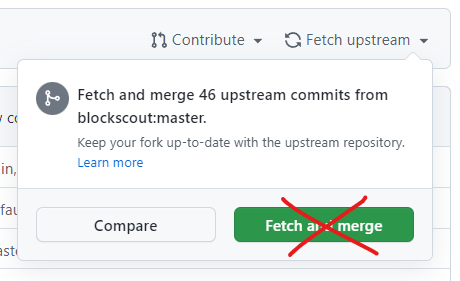

# Update Blockscout

This document describes when and how we should sync this repository with the new features and fixes available in the main repository of [Blockscout](https://github.com/blockscout/blockscout).

Blockscout maintainers update their `master` branch frequently, including changes that are not necessarily stable. This raises the question of how often we should update our repository with the new changes that continually appear in the main repository.

Ideally, we should synchronize our repository quite frequently, but we also need to protect ourselves from bringing changes that have not yet been properly validated and tested.

We also need to manage the complexity derived from the fact that we need to apply and maintain certain changes on top of their work, like style changes, domain translations, custom features, fixes, etc.

# When to sync

Blockscout has a quite frequent [release](https://github.com/blockscout/blockscout/releases/) pace. Unless some exceptional fixes or improvements are unreleased, we want to sync our repository only when a new release is published on the Blockscout main repository. Their releases are [tagged](https://github.com/blockscout/blockscout/tags) so normally, we should sync our repo whenever we are behind one or more releases/tags and only **up to the commit** of the selected release/tag. In other words, we don't want to bring to our repository any commit published after the commit that has been tagged as a release.

# How to sync

Given that we want to be selective about the target commit we want to bring to our repository, we **can not** use the *Fetch and merge* upstream button available on the UI of GitHub, since this button would bring all the commits present in their `master` branch to our `master` branch.



Instead, we will use the command line to selectively bring the new changes. Let's see how.

## Configuring an upstream remote

The first thing we need to do is set up a new upstream remote.

You may want to check your current remote configuration before adding the new upstream:

```bash
$ git remote -v
origin    git@github.com:hermeznetwork/blockscout.git (fetch)
origin    git@github.com:hermeznetwork/blockscout.git (push)
```

Now, we can add the upstream remote using the following command:

```bash
$ git remote add upstream git@github.com:blockscout/blockscout.git
```

Now we have a remote repository configured as upstream. Let's verify it:

```bash
$ git remote -v
origin    git@github.com:hermeznetwork/blockscout.git (fetch)
origin    git@github.com:hermeznetwork/blockscout.git (push)
upstream  git@github.com:blockscout/blockscout.git (fetch)
upstream  git@github.com:blockscout/blockscout.git (push)
```

Now that we have properly configured the upstream, we can fetch all the branches and tags from the main repository:

```bash
$ git fetch upstream
```

Now we can list all the tags (a.k.a releases) of the main repo of Blockscout:

```bash
$ git tag
v1.0-beta
v1.0.1-beta
v1.1.0-beta
....
v4.1.0-beta
v4.1.1-beta
v4.1.2-beta -> this is the last tag, so we want to bring changes up to this point
```

Let's now create a new local branch from our up-to-date `master` branch and bring the changes from the main Blockscout repository **up to the selected tag** *v4.1.2-beta.*

```bash
$ git checkout -b blockscout-master
$ git merge v4.1.2-beta
```

Since our repository may diverge from the original, at this point we may face conflicts that require a manual merge. After fixing the possible conflicts and committing the merge, the only step left is opening a PR in our repository from the branch `blockscout-master` against our `master` branch.

Once the PR is merged, our `master` branch will contain the version `v4.1.2-beta` of Blockscout with our custom commits on top.